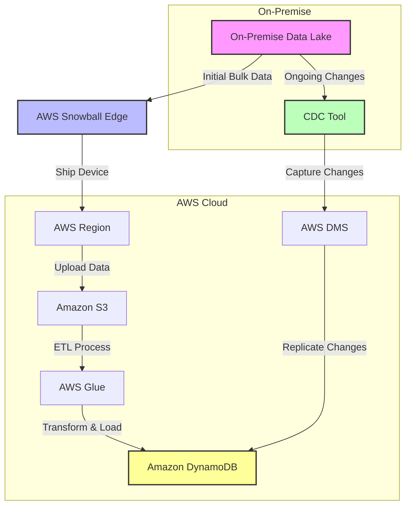

# wiki

```mermaid
graph TD
    A[On-Premise Data Lake] -->|Initial Bulk Data| B[AWS Snowball Edge]
    B -->|Ship Device| C[AWS Region]
    C -->|Upload Data| D[Amazon S3]
    D -->|ETL Process| E[AWS Glue]
    E -->|Transform & Load| F[Amazon DynamoDB]
    
    A -->|Ongoing Changes| G[CDC Tool]
    G -->|Capture Changes| H[AWS DMS]
    H -->|Replicate Changes| F
    
    subgraph "On-Premise"
    A
    G
    end
    
    subgraph "AWS Cloud"
    C
    D
    E
    F
    H
    end
    
    style A fill:#f9f,stroke:#333,stroke-width:2px
    style F fill:#ff9,stroke:#333,stroke-width:2px
    style B fill:#bbf,stroke:#333,stroke-width:2px
    style G fill:#bfb,stroke:#333,stroke-width:2px


```
